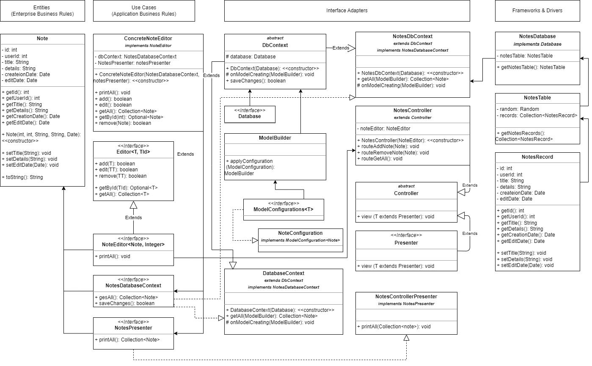

## Урок 6. Принципы построения приложений «чистая архитектура»
### Задание
1. Выпустить диаграмму компонент UML на основе материала разработанного на семинаре.

### Решение
1. Запуск консольной программы осуществляется через файл Program.java
2. UML диаграмма компонентов системы "Редактор 3D графики"
